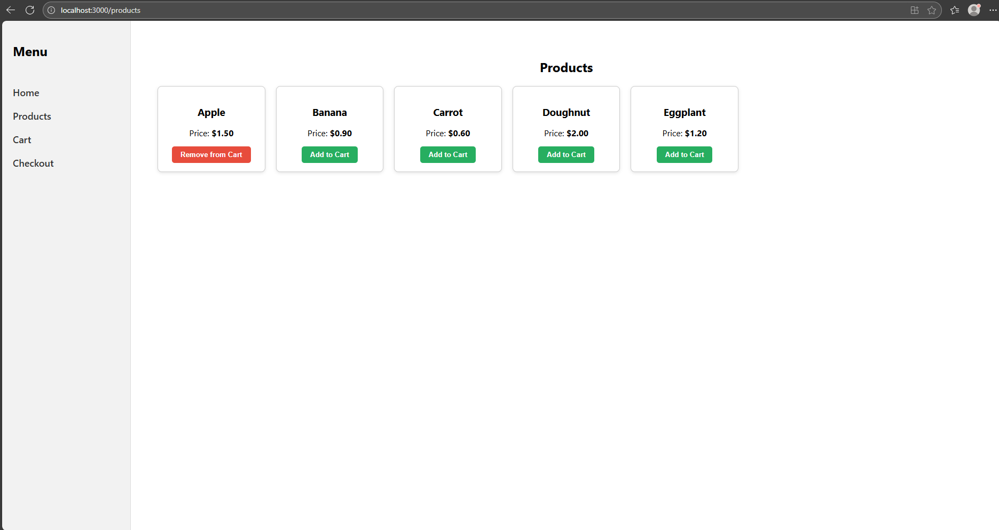
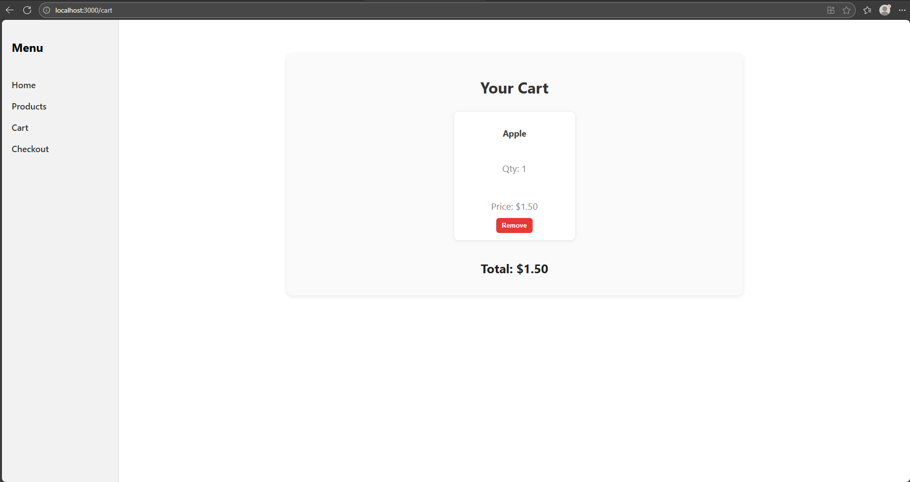
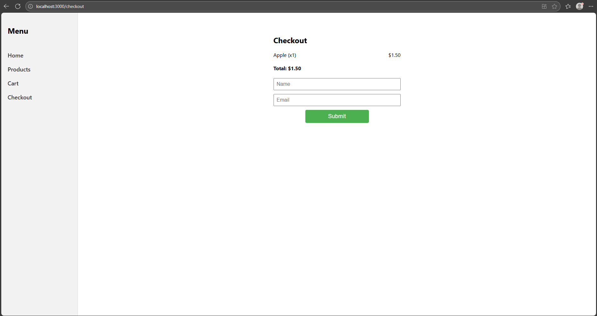
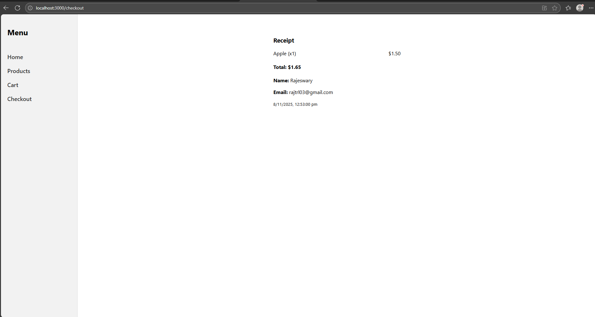

# Simple E-Commerce App (React + Node.js)

A minimal full-stack e-commerce application built using **React** (frontend) and **Node.js/Express** (backend).  
Users can browse products, add them to a cart, and complete a simple checkout.

## Features

- Browse product listings
- Add items to cart
- View cart summary with total price
- Checkout with name and email
- Fully responsive layout with left navigation and right content display

---

## Project Structure

/mock-ecom-cart
│
├── /frontend # React app (UI)
│ ├── src/pages # Home, Products, Cart, Checkout
│ ├── src/App.js
│ └── etc. req files
│
├── /backend # Node.js Express API
│ ├── server.js
│ └── package.json
│
└── README.md # Project documentation


## Setup Instructions

### 1. Clone the repository
```bash

git clone https://github.com/rajeswary2001/mock-ecom-cart.git

2. Run the backend
cd backend
npm install
node server.js


Server runs on http://localhost:5167

3. Run the frontend
cd ../frontend
npm install
npm start


Frontend runs on http://localhost:3000

```

### 🏠 Home Page


### 🛒 Products Page


### 🧾 Cart Page


### ✅ Checkout Page (Before Checkout)


### ✅ Checkout Page (After Checkout)



🧠 Explanation

This project demonstrates:

React component-based architecture

React Router for navigation

State management for cart items

Simple backend API for products

Full-stack setup with separate frontend and backend directories